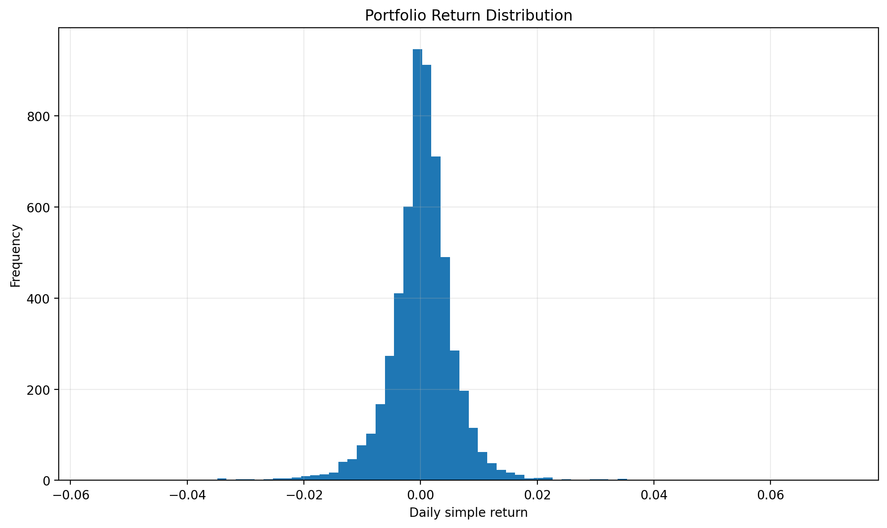
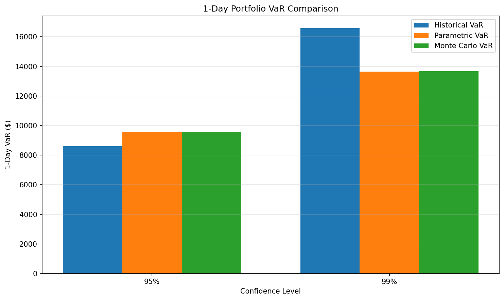
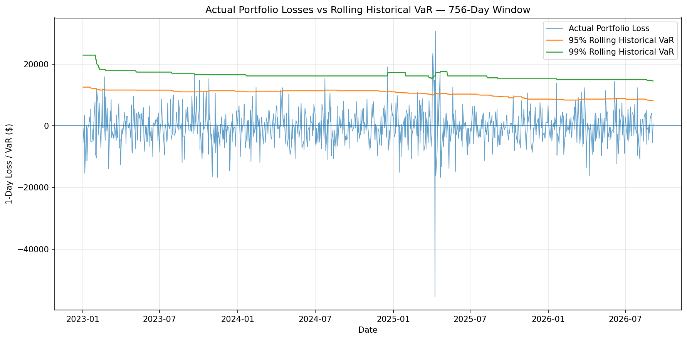
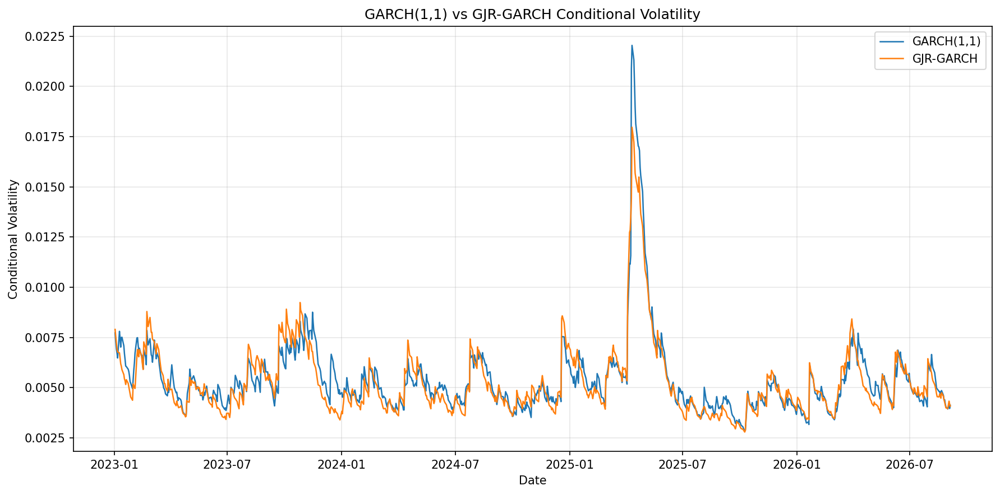

# Multi-Asset Market Risk Engine

A quantitative market-risk framework for a multi-asset portfolio covering Value at Risk (VaR), Expected Shortfall (ES), volatility modeling, backtesting, conditional risk forecasting, and stress testing.

## Portfolio

| Asset | Weight |
|---|---:|
| SPY | 50% |
| EURUSD | 20% |
| TLT | 30% |

Portfolio value: **$1,000,000**

Risk horizon: **1 trading day**

Confidence levels: **95% and 99%**

The framework uses simple returns for portfolio risk calculations and applies daily rebalancing with no transaction costs.

## Risk Models

### VaR and Expected Shortfall

- Historical VaR
- Historical Expected Shortfall
- Parametric VaR
- Parametric Expected Shortfall
- Monte Carlo VaR
- Monte Carlo Expected Shortfall

### Rolling Out-of-Sample Risk

- 756-trading-day rolling window
- Historical VaR
- Parametric VaR
- Out-of-sample evaluation from 2023 onward
- Actual portfolio losses versus VaR
- VaR breach analysis

### Backtesting

- Kupiec Proportion of Failures (POF)
- Christoffersen independence test
- Christoffersen conditional coverage test

### Volatility and Conditional Risk

- EWMA volatility
- GARCH(1,1)
- GJR-GARCH
- Conditional VaR
- GARCH versus GJR-GARCH comparison
- Walk-forward forecasting

### Stress Testing

Historical stress periods:

- Global Financial Crisis: 2008–2009
- COVID-19 market shock: 2020
- 2022 market stress

Hypothetical scenarios:

- Moderate market shock
- Severe market shock
- Custom asset-level shocks

## Data

Market data is obtained using Yahoo Finance through `yfinance`.

Assets:

- SPY
- EURUSD
- TLT

The dataset contains historical prices from 2005 onward.

Data processing includes:

- adjusted prices
- missing-value handling
- short-gap forward filling
- log-return calculation
- processed price and return datasets

## Project Structure

```text
Multi-Asset-Market-Risk/
│
├── data/
│   ├── raw/
│   └── processed/
│       ├── prices.csv
│       └── returns.csv
│
├── notebooks/
│   ├── 01_data_exploration.ipynb
│   ├── 02_portfolio_analysis.ipynb
│   ├── 03_volatility_dependence.ipynb
│   └── 04_var_es_backtesting_stress.ipynb
│
├── results/
│   ├── figures/
│   └── tables/
│
├── src/
│   ├── data/
│   ├── analytics/
│   └── risk/
│
└── test/
```
## Visual Results

### Portfolio Return Distribution and VaR

The portfolio return distribution illustrates the observed daily return behavior of the 50% SPY, 20% EURUSD and 30% TLT portfolio, with VaR thresholds used to quantify tail risk.




### VaR Method Comparison

Comparison of Historical, Parametric and Monte Carlo Value-at-Risk estimates at the 95% and 99% confidence levels.




### Rolling VaR and Realized Losses

The rolling VaR analysis evaluates out-of-sample risk from 2023 onward and compares estimated VaR with realized portfolio losses.




### GARCH vs GJR-GARCH Volatility

Comparison of conditional volatility estimates from the symmetric GARCH(1,1) model and the asymmetric GJR-GARCH model.


